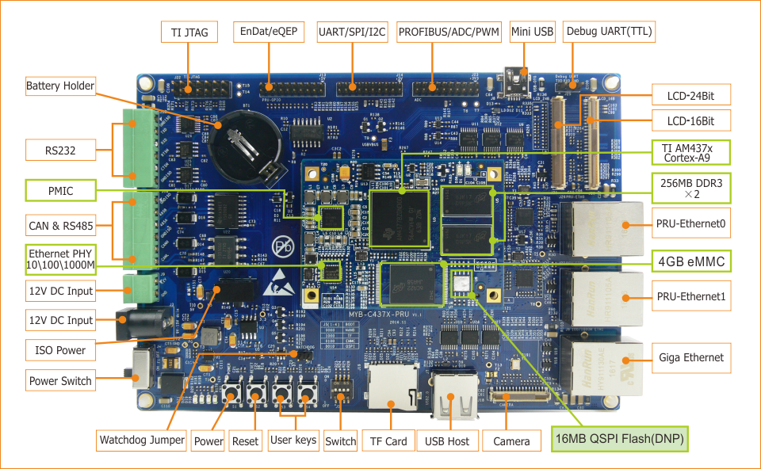

##2. Deploy Development Environment  
---------------------

The following section covers the setup of hardware, deployment and verification of software development environment.  

**Software Preparation：**  
  * One host PC with Ubuntu 12.04 64bit Desktop   
  * One host PC Windows7/Windows10

**Cross Compiler：**  
  * gcc-linaro-5.3-2016.02-x86_64_arm-linux-gnueabihf.tar.xz
  * ti_cgt_pru_2.1.3_linux_installer_x86.bin

**Hardware Preparation:**  

Connect the TTL Debug Interface J25(Debug UART in the following picture)to PC with a USB to TTL converter and set the baudrate of serial port on  host PC to 115200-8-n-1. Ethernet interface J6(Giga Ethernet in the following picture) is corresponding to MAC0 of AM437X; J26 and J27 are industrial ethernet interface shown as PRUETH0 and PRUETH1 in the following picture.
If you wat to debug with JTAG emulator, please connect the xds100v3 compatible emulator to J22(TI-JTAG interface).
A actual whole picture of MYD-C437X-PRU is shown below:  

  
Figure 2-1 MYD-C437X-PRU Interface Definition  

** Create Work Directory:**

Create a work directory and copy the resources from *04-Linux_Source* of our release package to the work directory on ubuntu host PC，`<WORKDIR>`
here is defined by customers according to their development environment.
```c
$ mkdir -p <WORKDIR>
$ cp -rf /cdrom/04-Linux_Source/* <WORKDIR>
$ ls  <WORKDIR>
Bootloader/  Examples/  Filesystem/  Kernel/  ToolChain/  Tools/
```
