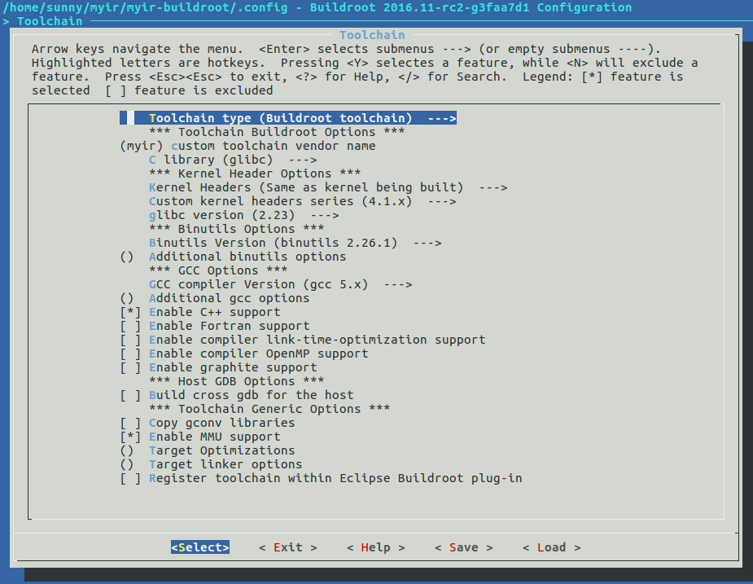
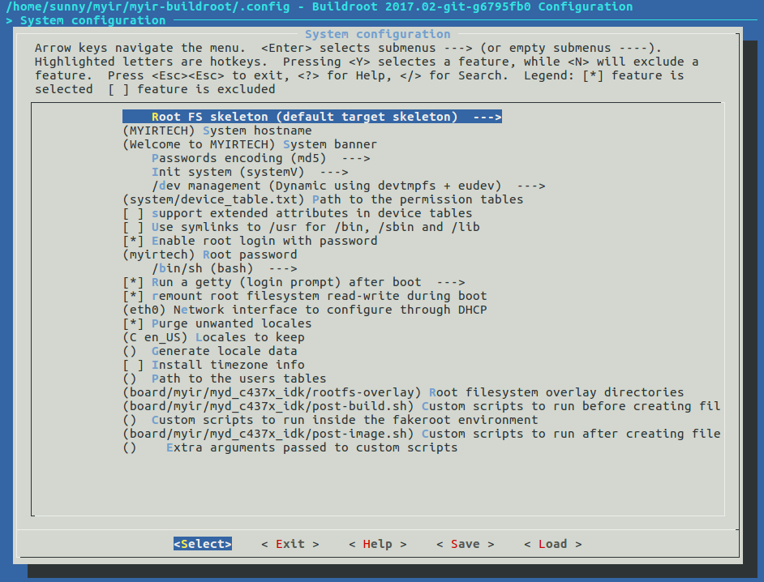
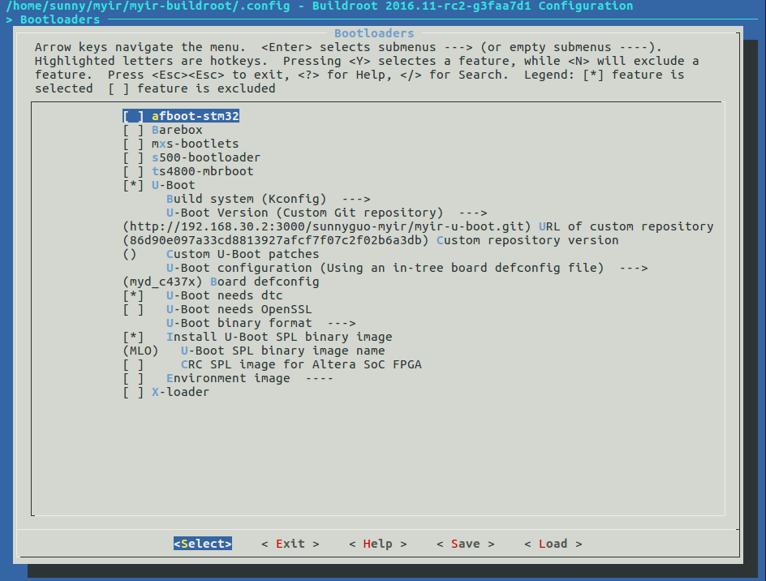
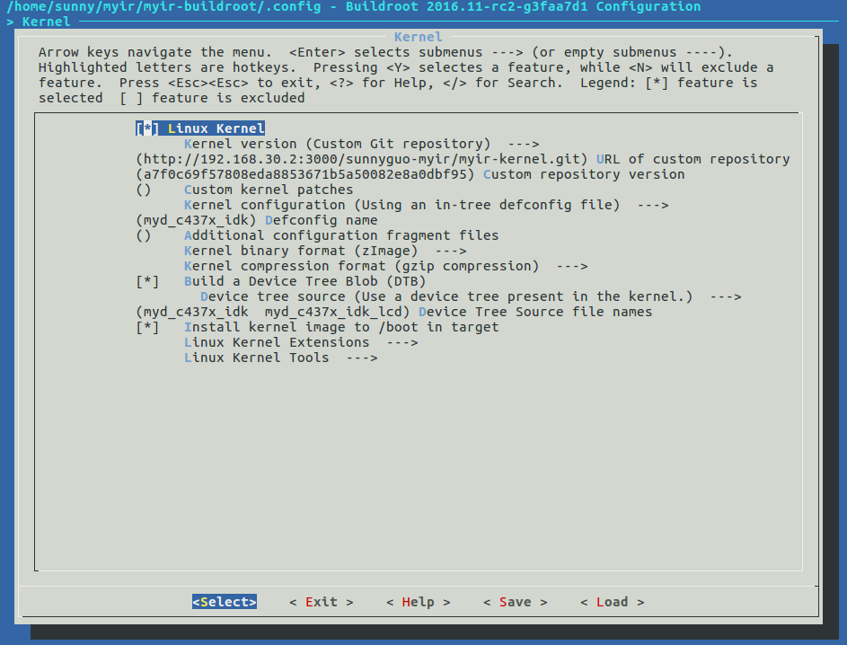
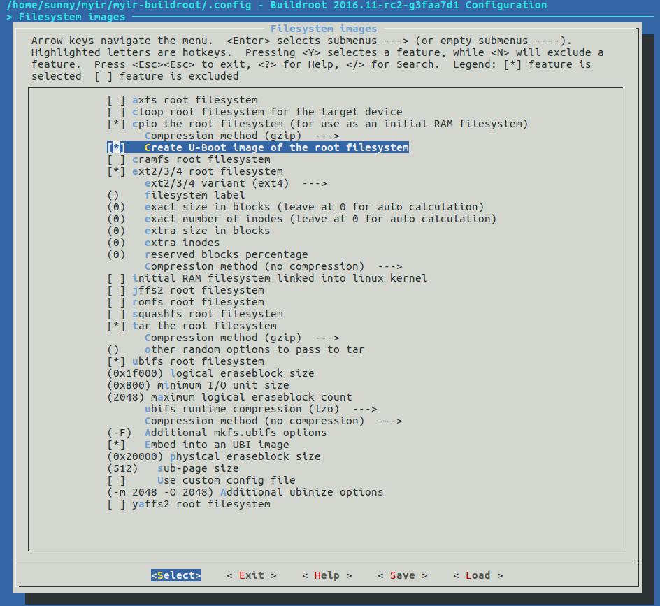
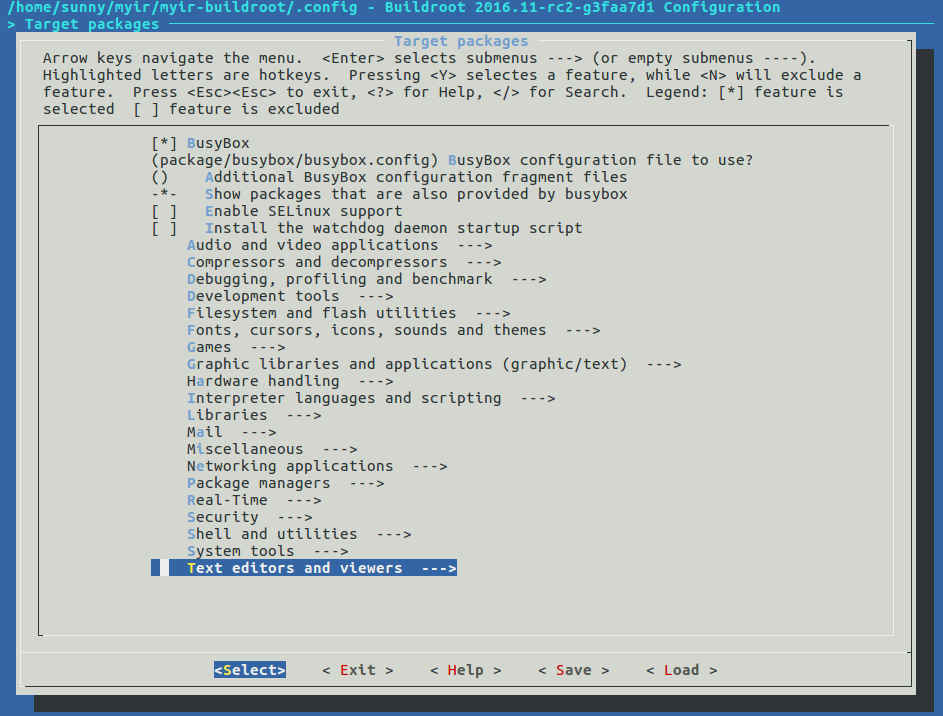

###3.3 Build Filesystem  

This section covers the buiding of filesystem with Buildroot.  

###3.3.1 Preparation before Building Buildroot  

At the beginning of this document, we have setup the environment variables for Ubuntu, it is also effective for building Buildroot.  

> Note: For Ubuntu 64bit OS, 32bit runtime libraries should be installed as shown below.  

```
$sudo apt-get install libc6-i386 lib32stdc++6 lib32z1
```   

Copy the Buildroot source package customized by myirtech from *04-Linux_Source/Filesystem/myir-buildroot.tar.gz* of our release package to work directory and uncompress it.
The content of myir-buildroot.tar.gz is shown below:
```
$ ls <WORKDIR>/Filesystem/myir-buildroot
arch   CHANGES           configs     dl    linux            output   support
board  Config.in         COPYING     docs  Makefile         package  system
boot   Config.in.legacy  DEVELOPERS  fs    Makefile.legacy  README   toolchain

```
For more details about the file structure of `Buildroot`, please refer to Buildroot manual[https://buildroot.org/downloads/manual/manual.html](https://buildroot.org/downloads/manual/manual.html). 
The support files for `MYD-C437x-PRU` development board are located at `<WORKDIR>/Filesystem/myir-buildroot/board/myir/myd_c437x_idk`.  

###3.3.2 Build Buildroot  

The configuration files for Buildroot are all located at *myir-buildroot/configs/*. We have provided two config files `myd_c437x_idk_defconfig` and `myd_c437x_idk_qt5_defconfig`.
Customers can build Buildroot just like building kernel as shown below: 
```
$ make myd_c437x_idk_defconfig
$ make
```  
During compiling Buildroot, an output directory named as `output` will be created, and all the output images are all stored to the sub directory `images` of `output`.
The following files are images for MYD-C437X-PRU development board generated by Buildroot.  

```
$ls -al output/images
boot.vfat              readme.txt         rootfs.ext4    sdcard.img        uEnv.txt
MLO                    rootfs.cpio        rootfs.tar     u-boot.img        zImage
myd_c437x_idk.dtb      rootfs.cpio.gz     rootfs.tar.gz  u-boot-spl.bin
myd_c437x_idk_lcd.dtb  rootfs.cpio.uboot  rootfs.ubi     uEnv_mmc.txt
ramdisk.gz             rootfs.ext2        rootfs.ubifs   uEnv_ramdisk.txt

```  

The bootloader, kernel and all kinds of filesystem images are generated all in one step, they will be introduced in the subsequent section.

###3.3.3 Buildroot Configuration   

Before compiling Buildroot, customers can change the configuration by its kernel-like menuconfig.  
The main configuration for `MYD-C437X-PRU` development board are listed below.   

* Configuration for Cross Compiler:    

Buildroot can use internal cross compile toolchain generated by Buildroot itself, it can also use external cross compile toolchain. In this 
document, we choose the internal cross compile toochain, it will be generated and stored to `<WORKDIR>/Filesystem/myir-buildroot/output/host/usr/bin/` after compiling.  
  
	  
Figure 3-3-1 Configuration for Cross Compiler    
  
* Configuration for System:  

The configuration for system includes the name of the target system, the welcome message, the init subsystem(busybox/systemV/systemd) and device manage system,
customers can also set the password for root user by configuration. For MYD-C437X-PRU development board, the password for root is set to `myirtech` as default, it is shown below.
If customers do not need to set password, they no need to config the password.  

	  
Figure 3-3-2 Configuration for System    

* Configuration for Bootloader:  

The configuration for Bootloader includes the URL of the source code of U-boot, the U-boot configuration file name, the output images of U-boot and so on. They are shown in Figure 3-3-3 below.
We fetch the source code of U-boot with git here, customers can use other protocols or even local directory. For other protocols, please refer to the Buildroot manual.  
   
	  
Figure 3-3-3 Configuration for Bootloader    

> Note: Please create a git repo for U-boot and replace the config `BR2_TARGET_UBOOT_CUSTOM_REPO_URL`  
  
 
* Configuration for Kernel:  

The configuration for Kernel is similar with the configuration for Bootloader. 
  
  
Figure 3-3-4 Configuration for Kernel   

> Note: Please create a git repo for Kernel and replace the config `BR2_LINUX_KERNEL_CUSTOM_REPO_URL`  

* Configuration for Filesystem:  

The configuration for filesystem determines what filesystem images are generated in *myir-buildroot/output/images/* directory after compiling, If we choose `ramdisk` in the configuration, we will
get a ramdisk filesystem image. EXT2/4, UBIFS, and rootfs tar package can also be create if they are choosed in configuration.  
By the way, the rootfs.tar.gz can be uncompressed and used as the nfsroot directory, it can also be made to other formats of filesystem images by host mtd-utils.
For example, we can create a UBIFS filesystem image without building Buildroot again after doing some modification for rootfs. Firstly, we create a file `ubinize.cfg` as shown below:  
  
```
[ubifs]
mode=ubi
vol_id=0
vol_type=dynamic
vol_name=rootfs
vol_alignment=1
vol_flags=autoresize
image=rootfs.ubifs
```  
Then, make a UBIFS image with UBIFS tools by the following processes:    

```
$ export PATH=$PATH:<WORKDIR>/Filesystem/myir-buildroot/output/host/usr/sbin
$ mkdir rootfs
$ tar zxvf rootfs.tar.gz -C ./rootfs  
$ mkfs.ubifs -d rootfs -e 0x1f000 -c 2048 -m 0x800 -x lzo -F -o  rootfs.ubifs
$ ubinize -o rootfs.ubi -m 0x800 -p 0x20000 -s 512 -m 2048 -O 2048 ubinize.cfg
```   
> Note: If `mkfs.ubifs` was installed already on Ubuntu OS, please rename it to another name. Users can check the path of 'mkfs.ubifs' with command `which mkfs.ubifs` to make sure
the path is located at `<WORKDIR>/Filesystem/myir-buildroot/output/host/usr/sbin/`.   

	  
Figure 3-3-5 Configuration for Filesystem  
 
  
* Configuration for Target Packages:  

The configuration for target packages is easier, but it is changed more frequently. Customers can choose some hardware tools, such as I2C-tools, spi-tools, can-utils and so on, build them into
the filesystem images for debugging. Some network utils, such as DHCP, TFTP, SSH and so on, can aslo be choosed and built into the filesystem images for production. 
Most commonly used tools are included in the target packages of Buildroot. Customers can also write new target packages and integrate them to Buildroot, please refer to [https://buildroot.org/downloads/manual/manual.html#adding-packages](https://buildroot.org/downloads/manual/manual.html#adding-packages) for details.
  
	  
Figure 3-3-6 Configuration for Target Packages    

###3.3.4 Filesystem Built by Arago   

Customers can also run an demo filesystem image created with Arago on a MYD-C437X-PRU development board, it was created by TI, please refer to the WIKI page on TI's websit.    
[http://processors.wiki.ti.com/index.php/Processor_SDK_Building_The_SDK](http://processors.wiki.ti.com/index.php/Processor_SDK_Building_The_SDK).  


