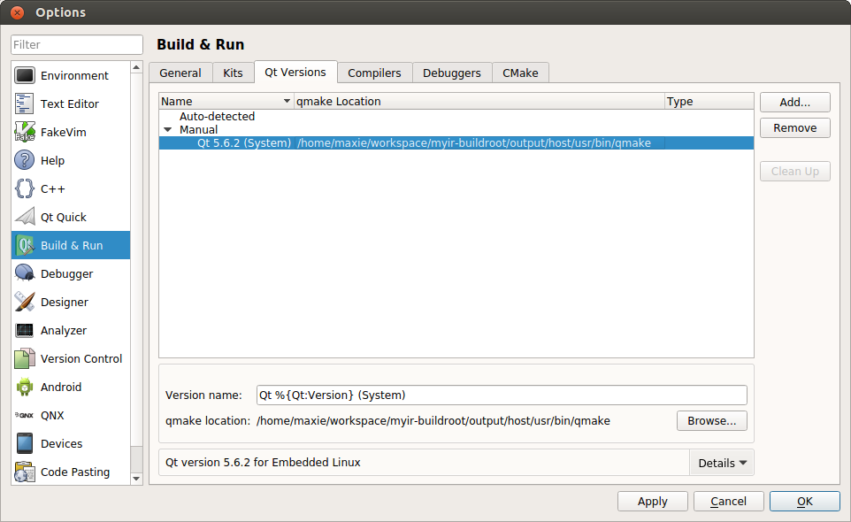
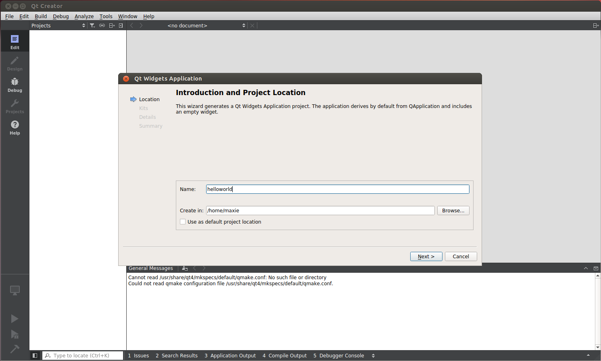

## 5.2 Config QtCreator 

* Config Build&Run Environment:    

Open QtCreator, choose `tools`->`options`, then the `Build & Run` dialog popups`. 
Please choose the `Compilers` tab to set compiler for QtCreator as shown below:  

  
Figure 5-2-1 Settings of Compiler   

Press `Add` button at the right side of this dialog, choose `Custom` in the dropdown list, and then set `Name`, `Compiler path`, `Make path` 和 `ABI` as shown below.
After complete, press the `Apply` button to save.  

  
Figure 5-2-2 Add Compiler for QtCreator    

At the same dialog, choose `Qt Version` Tab to add qmake, at the right side of this dialog, press `Add` button, then a new dialog popups,
please choose the qmake tools described at Chapter 3-4-1. After complete, press `Open` to set qmake, and then `Apply` to save. 

  
Figure 5-2-3 Choose qmake   

In the `Build&Run` window, continue to choose `Kits` tab, and at the right side of this dialog, press `Add` button, then add settings of running environment for QT5 application. In the `Sysroot` editbox, write the path of cross compile toolchain, in the `Compiler` and `Qt Version` editboxs, write the settings being set before, set `Debugger` to `None`, set `CMake Tools` to default as shown below:   

  
Figure 5-2-4 Add Kits for QtCreator

* Create Helloworld Project:       

In the main menu of QtCreate, choose `File`->`New File or Project`, and in the popup dialog, choose `Application`->`Qt Widgets Application` as shown below:  

  
Figure 5-2-5 Create a QT Widgets Application  

After pressing `Choose...` button, the `Qt Widgets Application` settings dialog popups, please set the name and path of the project as shown below in `Name` and `Create in` editboxs as shown below:    

  
Figure 5-2-6 Set the Name and Path of the Project  

Press `Next` button and choose the setting for `Kits` as below:  

Figure 5-2-7 Set Kits for the Project  

Choose the base class of the project as shown below:  

  
Figure 5-2-8 Choose Base Class  

Press `Finish` button to create and save the project.  

  
Figure 5-2-9  Finish Creating a New Project  

