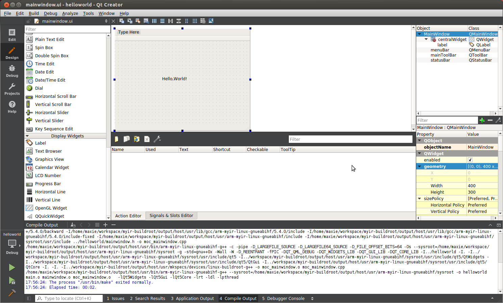

## 5.3 Build QT Application  

In the previous section, a QT5 project named as `helloworld` has been created. 
It is shown in the project manage of QtCreator as below:  

  
Figure 5-3-1 Project Manager of QtCreator    

Double click the `mainwindow.ui` at the left side to open the `Design` view for designing a UI for helloworld project visually. 
Please drag a `Label` widget to the center of the mainwindow from the widgets list, double click the label and input `Hello, world!".  

  
Figure 5-3-2 UI Design View  

After complete, choose `Build`->`Build Project` in the main menu of QtCreator to build the helloworld project. 
Some log information outputs to the `Compile Output` sub window during compiling, in case of any erros and warning, please fix them and build again.  

  
Figure 5-3-3 Build Project   

After building,  a binary format QT5 application is generated at *~/build-helloworld-myir_dev_kit-Debug/*, please use `file` command to check it and 
make sure it can work on ARM embedded Linux system as below:  

```
file helloworld
helloworld: ELF 32-bit LSB executable, ARM, version 1 (GNU/Linux), dynamically linked
 (uses shared libs), for GNU/Linux 4.1.0, not stripped
```

Finaly, please copy the binary format application `helloworld` to `/usr/bin` directory of MYD-C437X-PRU development board and execute as below:  

```
# helloworld  --platform linuxfb:fb=/dev/fb0
```
A Window with a `Hello,World!` text label displays on the LCD screen as below:  

  
Figure 5-3-4 Execute QT5 Application   


