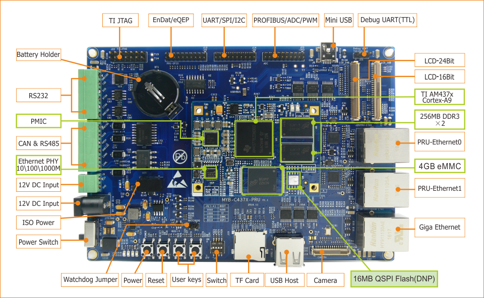

##2. 部署开发环境  
---------------------

本节主要介绍开发过程中所使用的软件开发环境选择，硬件调试环境的搭建和交叉编译工具链的配置以及验证。

**软件开发环境：**  
  * Ubuntu12.04 64位桌面版  
  * Windows7/Windows10主机

**交叉编译器：**  
  * gcc-linaro-5.3-2016.02-x86_64_arm-linux-gnueabihf.tar.xz
  * ti_cgt_pru_2.1.3_linux_installer_x86.bin

**硬件调试环境:**  

将TTL电平调试串口J25（图中Debug UART）通过USB转TTL电平调试线连到PC上，并设置PC端串口的波特率设为115200，数据位为8，停止位为1，无奇偶校验。如需要网络调试，请用网线连接开发板J6(图中Giga Ethernet)。
具体如下图：  
  
图2-1 MYD-C437X-PRU接口定义


**建立工作目录:**

创建工作目录, 并拷贝MYD AM437X系列开发板出厂附带资料04-Linux_Source目录到Linux开发主机中，<WORKDIR>具体目录用户可根据实际情况调整，后文不再赘述，如下所示：  
```c
$ mkdir -p <WORKDIR>
$ cp /media/cdrom/04-Linux_Source/* <WORKDIR> -rf
$ ls  <WORKDIR>
Bootloader/  Examples/  Filesystem/  Kernel/  ToolChain/  Tools/
```
