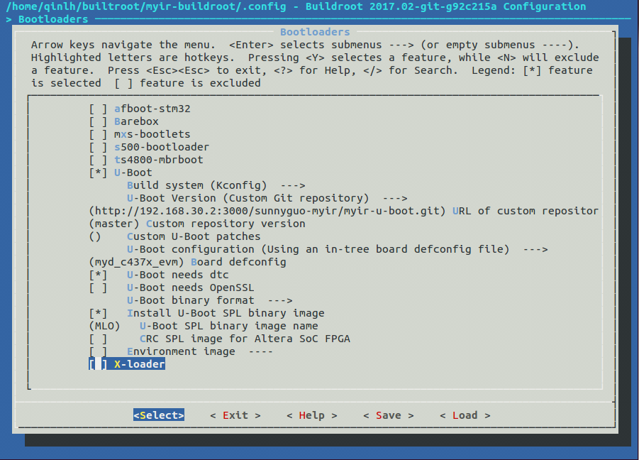
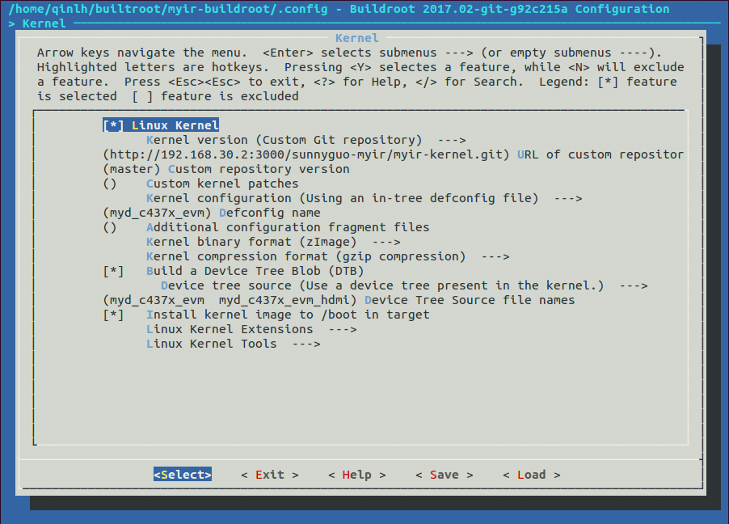
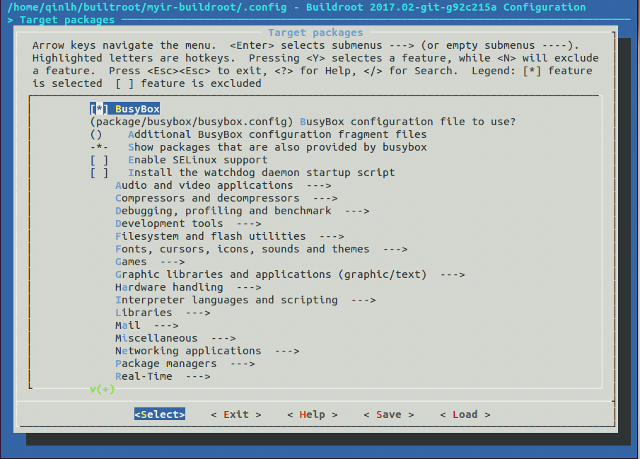

###3.3 制作文件系统  

本节主要介绍使用Buildroot进行文件系统的制作。

###3.3.1 准备编译Buildroot  

在本手册的开头介绍了开发环境的部署，同样适用于Buildroot。不
过需要注意的是在64位的系统上，需要安装32位兼容的库。
```
$sudo apt-get install libc6-i386 lib32stdc++6 lib32z1
```
拷贝出厂附带资料中的*04-Linux_Source/Filesystem/myir-buildroot.tar.gz*到本地开发主机，并解压到本地工作目录<WORKDIR>(注意用本地主机上实际工作目录替换<WORKDIR>)，如下所示：
```
$ ls <WORKDIR>/Filesystem/myir-buildroot
arch   CHANGES           configs     dl    linux            output   support
board  Config.in         COPYING     docs  Makefile         package  system
boot   Config.in.legacy  DEVELOPERS  fs    Makefile.legacy  README   toolchain

```
关于`Buildroot`的目录结构可以参照[https://buildroot.org/downloads/manual/manual.html](https://buildroot.org/downloads/manual/manual.html). 其中和`MYD-C437x-EVM`开发板相关的部分主要位于`<WORKDIR>/Filesystem/myir-buildroot/board/myir/myd_c437x_evm`目录。   


###3.3.2 配置说明  

在make之前，可以通过`make menuconfig`进入配置界面。然后可以跟内核配置一样，对当前的配置进行一些修改。下面以`MYD-C437X-EVM`平台为例，加以说明。

* 配置交叉编译工具链:    

Buildroot可以使用外部交叉编译工具链，也可以自行编译产生内部交叉编译工具链，本手册采用的是内部交叉编译工具链。编译完成之后位于`<WORKDIR>/Filesystem/myir-buildroot/output/host/usr/bin/`。
  
	  
图3-3-1 配置Buildroot交叉编译工具链  
  
* 配置系统参数：    

系统配置主要配置目标系统的主机名称，欢迎信息，Init子系统（busybox/systemv/systemd)和对应的设备管理子系统，这里还可以配置root的登陆密码，如下图所示为目标系统配置了root登陆密码`myirtech`。
如果不配置的话，密码为空。  

	  
图3-3-2 系统配置  

* 配置bootloader：    
> 注意：用户获取到U-boot代码之后，请自行建立Git仓库，替换配置中的BR2_TARGET_UBOOT_CUSTOM_REPO_URL配置  

Bootloader配置主要配置bootloader的代码来源，以及代码的配置，编译，安装，如下图所示。这里采用的是git协议从内网的git服务器获取代码。用户也可以根据实际情况配置合适的代码获取方式，具体的配置方式也可以参考Buildroot用户手册。
   
	  
图3-3-3 bootloader配置   


 
* 配置Kernel：  
> 注意：用户获取到Kernel代码之后，请自行建立Git仓库，替换配置中的BR2_LINUX_KERNEL_CUSTOM_REPO_URL配置  


Kernel的配置和bootloader类似，主要配置内核代码的获取方式，内核的配置文件和输出文件等。
  
  
图3-3-4 Kernel配置  
   

* 配置文件系统：  

文件系统的配置最终决定了`<WORKDIR>/Filesystem/myir-buildroot/output/images`目录下生成哪些格式的文件系统镜像，如下图所示。我们配置了ramdisk, EXT2/4以及UBIFS这几种文件系统镜像和rootfs.tar.gz根文件系统压缩包。
用户拿这个压缩包用于nfsroot文件系统加载，也可以生成其它格式的文件系统镜像。   
除此之外，编译完成之后还在`<WORKDIR>/Filesystem/myir-buildroot/output/host/usr/sbin`目录下生成一些本地主机上的文件系统工具，如制作ubi文件系统的工具mkfs.ubifs, ubinize等。我们可以用这些工具重新制作基于rootfs.tar.gz
的UBIFS格式文件系统(注意用本地主机上实际工作目录替换<WORKDIR>)。 

创建一个ubinize.cfg文件,内容如下：  
```
[ubifs]
mode=ubi
vol_id=0
vol_type=dynamic
vol_name=rootfs
vol_alignment=1
vol_flags=autoresize
image=rootfs.ubifs
```
准备需要打包的根文件系统目录rootfs并打包，步骤如下:   
```
$ export PATH=$PATH:<WORKDIR>/Filesystem/myir-buildroot/output/host/usr/sbin
$ mkdir rootfs
$ tar zxvf rootfs.tar.gz -C ./rootfs  
$ mkfs.ubifs -d rootfs -e 0x1f000 -c 2048 -m 0x800 -x lzo -F -o  rootfs.ubifs
$ ubinize -o rootfs.ubi -m 0x800 -p 0x20000 -s 512 -m 2048 -O 2048 ubinize.cfg
```   
> 注意：系统中可能默认已安装mkfs.ubifs, 请使用which mkfs.ubifs确认这里执行的命令位于`<WORKDIR>/Filesystem/myir-buildroot/output/host/usr/sbin`之下。  

	  
图3-3-5 文件系统配置  
  
* 配置工具包：    

工具包的配置相对比较简单，但也是用户经常会改动的配置项。linux下一些常见的工具基本上都能够在这里找到。比如硬件测试相关的I2C-tools, spi-tools, can-utils等，网络相关的DHCP, TFTP, SSH等,
用户可以根据需要自行配制，也可以添加自己编写的其他工具包。关于如何添加自己的工具包，在Buildroot中也有详细的介绍，参见[https://buildroot.org/downloads/manual/manual.html#adding-packages](https://buildroot.org/downloads/manual/manual.html#adding-packages),这里不再赘述。
  
	  
图3-3-6 工具包配置  
###3.3.3 开始构建

Buildroot构建的过程类似于Linux Kernel的构建，只需要简单的两个命令就可以完成。MYD-C437X-EVM平台默认的配置文件位于*myir-buildroot/configs/myd_c437x_evm_defconfig*. 其中主要包含一些硬件测试相关的工具，	用户也可以根据不同的应用场景需要编写自己的配置文件。
```
$ make myd_c437x_evm_defconfig
$ make
```
编译过程中会生成一个output目录，最终生成的输出的文件位于`<WORKDIR>/Filesystem/myir-buildroot/output/images`目录。
```
$ls -al output/images
boot.vfat ramdisk.gz rootfs.cpio.uboot rootfs.tar.gz u-boot.img uEnv_ramdisk.txt
MLO readme.txt rootfs.ext2 rootfs.ubi uEnv uEnv.txt
myd_c437x_evm.dtb rootfs.cpio rootfs.ext4 rootfs.ubifs uEnv_hdmi.txt zImage
myd_c437x_evm_hdmi.dtb rootfs.cpio.gz rootfs.tar sdcard.img uEnv_mmc.txt

```
output/images 目录下的输出文件基本上包含了bootloader, kernel, 以及各种格式的文件系统镜像。这些文件在接下来的系统升级章节将会详细介绍。
###3.3.4 Arago构建的文件系统
MYD-C437X-EVM也可以使用基于Arago构建的文件系统镜像，具体的构建方法可以参考TI官网WIKI页面.  
[http://processors.wiki.ti.com/index.php/Processor_SDK_Building_The_SDK](http://processors.wiki.ti.com/index.php/Processor_SDK_Building_The_SDK).  


