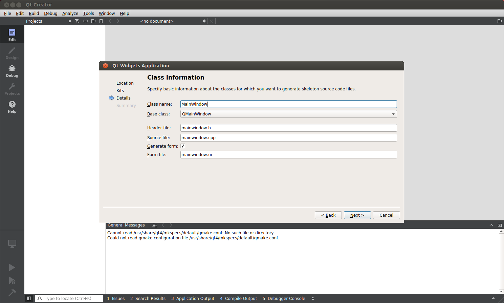

## 5.2 配置QtCreator

* 配置 QtCreator 开发环境:  

运行 QtCreator 后,依次点击`tools`->`options`,出现选项对话框,在左边点击`Build & Run`,右边选择`Compilers`标签。

  
图5-2-1 编译器选择  

点击右侧`add`,弹出下拉列表后,选择`custom`,在下侧填写以下内容: `Name`, `Compiler path`, `Make path` 和 `ABI`。填写完成后,点击`Apply`,进行保存。

  
图5-2-2 添加编译器  

在同一窗口下,选择`Qt Version`标签,在右侧点击`Add...`,会弹出对话框,切换目录到Chapter3-4-1中编译QT得到的SDK目录,选择`qmake`文件后,点击`open`按钮,设置完成之后，点击`Apply`按钮保存。

  
图5-2-3 选择qmake构建工具  

在`Build&Run`窗口，继续选择上边的`Kits`标签,点击右侧`Add`,填写相应内容。其中`Sysroot`选择编译工具链的目录,`compiler`选择之前填写的名称,`Debugger`选择`None`,`Qt version`选择之前添加时的名称,`CMake Tool`设置为默认。

  
图5-2-4 添加Kits

* 创建 Helloworld 项目:  

在菜单栏选择`File`->`New File or Project`,在打开的对话框中,依次选择`Application`->`Qt Widgets Application`,点击`Choose...`, 如下图所示:  

  
图5-2-5 创建新工程

在弹出的`Qt Widgets Application`对话框中,设置项目名称为`helloworld`,`Create in`一栏填写项目的存储路径, 如下：  

  
图5-2-6 设置新工程名称和路径  

点击`Next`后,选择之前添加好的`Kits`,继续点击`Next`, 如下:  

图5-2-7 设置新工程Kits  

选择当前的的应用继承自哪种Widget,默认选择QMainWindow,然后点击`Next`进入下一步。

  
图5-2-8 选择应用程序的类型  

以上信息填写完后,点击`Finish`, 完成QtCreator工程的创建。

  
图5-2-9 完成工程创建  

