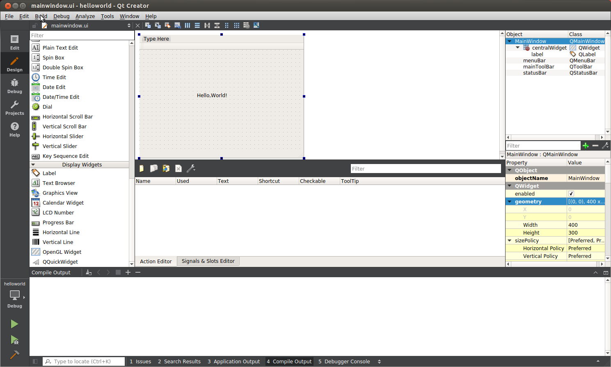
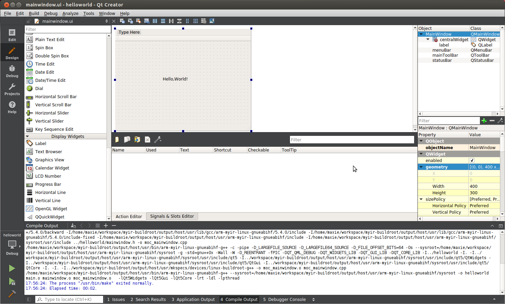
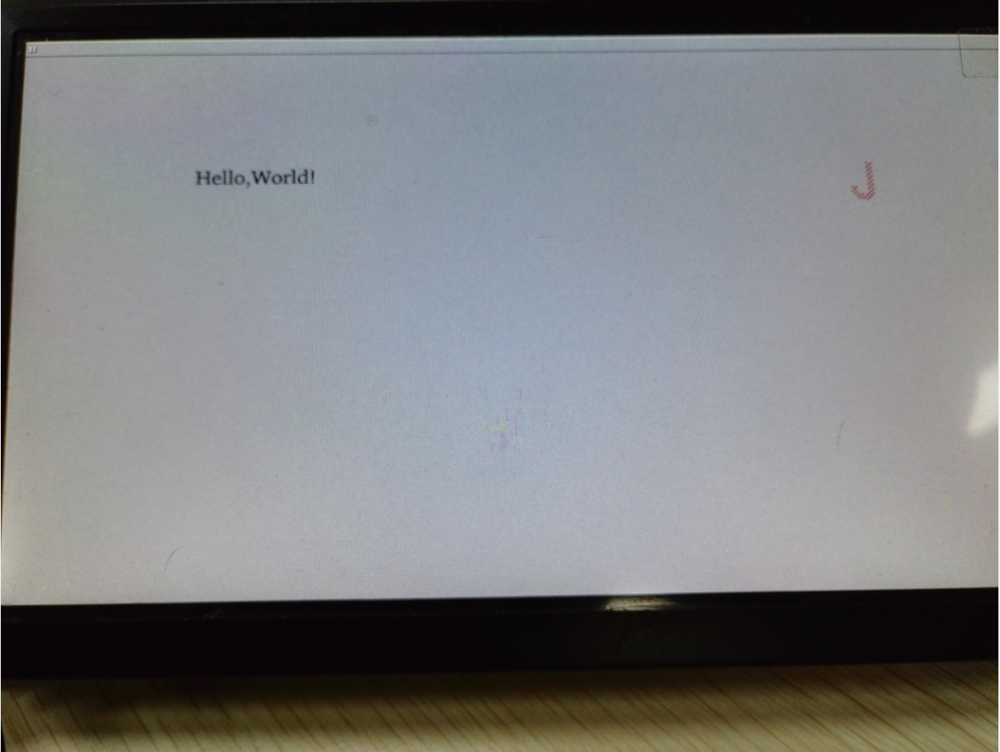

## 5.3 编译运行QT应用

以下是创建好的`helloworld`项目截图,左侧是`QtCreator`创建好的项目目录结构,右侧是代码编辑区。

  
图5-3-1 项目文件管理窗口  

双击左侧的`Forms`里的`mainwindow.ui`文件,打开`Design`视图,从左铡`Display Widgets`栏目下,拖动`Label`到中间的区域。双击后,修改内容为`Hello,world!`。

  
图5-3-2 可视化界面编辑  

完成以上操作后,就可以点击菜单栏`Build`->`Build Project hellowrld`,进行项目构建,此时下侧`Compile Output`会有编译信息输出。若有错误,请根据提示,修改正确后重新构
建。

  
图5-3-3 编译项目  

QtCreator 构建 helloworld 项目后,编译好的二进制文件存放在*~/build-helloworld-myir_dev_kit-Debug/*目录下,可以使用 file 命令查看,是否编译为 ARM 架构。

```
file helloworld
helloworld: ELF 32-bit LSB executable, ARM, version 1 (GNU/Linux), dynamically linked
 (uses shared libs), for GNU/Linux 4.1.0, not stripped
```

将生成的QT应用程序的可执行文件`helloworld`拷贝到开发板/usr/bin目录下,并在开发板上执行,如下：  

```
# helloworld  --platform linuxfb:fb=/dev/fb0
```
将会在 LCD 屏幕上看到`Hello,World!`的 Qt 窗口。

  
图5-3-4 QT应用程序执行  


