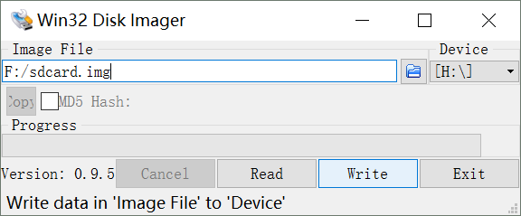
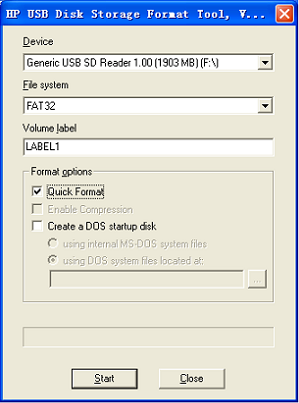

## 6. 系统更新

---

本节主要介绍嵌入式Linux系统构建完成之后，如何进行调试，固化和更新的操作。  
MYD AM437X系列每一块开发板出厂附带资料中都包含了对应开发板的出厂镜像文件。  
用户可以直接使用这些文件进行系统更新的操作，也可以通过前面章节中介绍自行构建系统之后，再行升级。

表6-1 MYD-C437X-PRU 预编译镜像文件列表

| 文件名 | 描述 |
| --- | --- |
| MLO | 一级引导（SPL） |
| u-boot.img | 二级引导程序 |
| myd\_c437x\_evm.dtb | MYD-C437X-EVM开发板配置设备树 |
| myd\_c437x\_evm\_hdmi.dtb | MYD-C437X-EVM开发板HDMI配置设备树 |
| zImage | 内核镜像 |
| uEnv.txt | 默认环境变量 |
| uEnv\_ramdisk.txt | 使用RAM DISK文件系统时的环境变量，实际使用时用该文件替换uEnv.txt放置到TF卡根目录 |
| ramdisk.gz | ramdisk文件系统压缩镜像 |
| rootfs.ubi | ubifs文件系统镜像 |
| rootfs.ext4 | ext4文件系统镜像 |
| rootfs.tar.gz | 文件系统目录压缩包 |
| sdcard.img | TF/SD/EMMC 镜像 |
| matrix-rootfs.ubi | TI官方ubifs文件系统镜像 |
| matrix-rootfs.tar.gz | TI官方ubifs文件系统目录压缩包 |

`MYD-C437X-EVM`开发板目前提供了多种系统引导加载方案。

* 方案1: TF卡启动\(EXT4文件系统\)
* 方案2: TF卡启动\(Ramdisk文件系统\)
* 方案3: EMMC启动（EXT4文件系统\)
* 方案4: NFS ROOT文件系统（主要用于文件系统调试）

其中方案3为出厂默认方案，下面分别对这几种方式的实现机制和烧写方法进行说明。

** U-Boot环境变量说明 **

使用TF卡或EMMC启动的时候，经常会用到uEnv.txt文件对U-Boot进行环境变量的设置。通过修改uEnv.txt下面的fdtfile参数，可以在启动时加载不同的设备树文件，从而适配不同的硬件配置。  
例如MYD-C437X-EVM开发板，可以通过uEnv.txt设置不同的fdtfile来实现。

```
#fdtfile=myd_c437x_evm.dtb        # 不使用HDMI
#fdtfile=myd_c437x_evm_hdmi.dtb   # 使用HDMI
```

** TF卡启动\(EXT4文件系统\) **

Buildroot编译完成之后生成sdcard.img，它是整个TF卡的磁盘镜像文件，其中包含两个分区，分区一为FAT格式，包含了MLO, u-boot.img, zImage和设备树，uEnv.txt等文件;  
分区二为EXT4格式，为该启动模式下的根文件系统。

  
图6-1  使用win32diskimager烧写sdcard.img

* 把TF卡插入USB读卡器，然后将读卡器跟windows主机连接。
* 使用win32diskimager.exe烧写sdcard.img到TF卡上，如图6-1所示。
* 烧写完成之后，将TF卡插入开发板TF卡槽，设置为TF卡启动模式，上电即可从TF卡引导启动，并加载位于TF卡上的EXT4根文件系统。

注意：烧写过程会清除TF/SD卡原有内容，请注意备份。

** TF卡启动\(Ramdisk文件系统\) **

Buildroot编译完成之后生成ramdisk.gz，它是压缩后的ramdisk根文件系统镜像。

  
图6-2 格式化TF卡

\(请使用光盘目录03-Tools目录下的HP USB Disk Storage Format Tool 2.0.6工具来格式化TF卡。\)

* 把MMC/SD卡插入USB读卡器，然后将读卡器跟电脑连接
* 格式化TF卡，如图6-2所示。

注意：HP USB Disk Storage Format Tool会将清除TF卡的分区。若需要保留分区，请使用电脑系统自带的格式软件。

* 将02-Images\Linux-image\目录下的所有文件拷贝到TF卡上，并将uEnv\_ramdisk.txt重命名为uEnv.txt，替换原来的uEnv.xt。 
* 将TF卡插入到开发板上的TF卡插槽，设置对应开发板的启动模式为TF卡启动，上电重启开发板即可从TF卡启动并加载ramdisk.gz作为根文件系统。

** EMMC启动（EXT4文件系统\) **

Buildroot编译完成之后生成的sdcard.img同样可以烧写到EMMC上，用于EMMC启动。

* 首先, 使用TF卡启动，加载ramdisk文件系统镜像。
* 系统启动完成之后，进入linux控制台运行updatesys.sh将TF卡上的sdcard.img写入到EMMC,如下。
* 烧写完成之后，拔下TF卡，设置开发板为EMMC启动模式，上电即可从EMMC引导启动，并加载位于EMMC上的EXT4文件系统。

```
# /updatesys.sh 
All data on eMMC now will be destroyed! Continue? [y/n]
y
[  138.794247] FAT-fs (mmcblk0p1): Volume was not properly unmounted. Some data may be corrupt. Please run fsck.
1024+0 records in
1024+0 records out
DISK SIZE - 3867148288 bytes
mkfs.fat 4.0 (2016-05-06)
mkfs.fat: warning - lowercase labels might not work properly with DOS or Windows
mkfs.fat 4.0 (2016-05-06)
mkfs.fat: warning - lowercase labels might not work properly with DOS or Windows
umount: /dev/mmcblk1p2: not mounted
mke2fs 1.43.3 (04-Sep-2016)
/dev/mmcblk1p2 contains a ext4 file system labelled 'rootfs'
        last mounted on /root/rootfs on Mon Jul  3 16:48:15 2017
Proceed anyway? (y,n) y
Discarding device blocks: done                            
Creating filesystem with 261615 4k blocks and 65408 inodes
Filesystem UUID: ec25c446-3589-4f51-a6ff-d092053157e5
Superblock backups stored on blocks: 
        32768, 98304, 163840, 229376

Allocating group tables: done                            
Writing inode tables: done                            
Creating journal (4096 blocks): done
Writing superblocks and filesystem accounting information: done

===> Update loader to emmc...
===> Updating kernel and devicetree to emmc...
===> Update uEnv to emmc...
===> Updating filesystem to emmc...


 Update system completed, The board can be booted from eMMC now 

```

** NFS ROOT启动\(挂载NFS ROOT文件系统\) **

Buildroot编译完成之后生成的rootfs.tar.gz，可以解压之后放到NFS服务器上作为NFS ROOT文件系统进行加载，便于文件系统的调试。  
使用NFS ROOT方式启动，首先需要配置TFTP和NFS服务，下面以ubuntu系统为例加以说明。

* 安装TFTP服务端:  

```
$ sudo apt-get install tftp-hpa tftpd-hpa
```

* 配置TFTP服务:  

创建TFTP服务器工作目录,并打开TFTP服务配置文件,如下:

```
$ mkdir -p <WORKDIR>/tftpboot
$ chmod 777 <WORKDIR>/tftpboot
$ sudo vi /etc/default/tftpd-hpa
```

修改或添加以下字段：

```
TFTP_DIRECTORY="<WORKDIR>/tftpboot"
TFTP_OPTIONS="-l -c -s"
```

重启TFTP服务:

```
$ sudo service tftpd-hpa restart
```

将出厂镜像或者自行编译的MLO, u-boot.img, zImage和设备树文件以及ramdisk.gz等拷贝到TFTP服务器的`<WORKDIR>/tftpboot`目录，在U-Boot命令行，即可以使用tftpboot命令加载TFTP服务器上`<WORKDIR>/tftpboot`目录下的文件,例如：

```
># help tftpboot
tftpboot - boot image via network using TFTP protocol

Usage:
tftpboot [loadAddress] [[hostIPaddr:]bootfilename]
># tftpboot ${loadaddr} 192.168.1.111:zImage
```

* 安装NFS服务:  

NFS即网络文件系统，允许主机直接通过网络实现文件系统挂载，还可以在Linux系统启动的时候将NFS服务器上的目录挂载为开发板的根文件系统。下面以ubuntu文件系统为例，介绍NFS服务的安装和配置。

```
$ sudo apt-get install nfs-kernel-server
```

* 配置NFS服务:  

编辑/etc/exports文件，添加NFS服务导出的工作目录

```
$ sudo vi /etc/exports
```

添加NFS ROOT根文件系统目录，下面以/home/myir/rootfs为例，将其添加到/etc/exports文件中, 如下：

```
/home/myir/rootfs *(rw,nohide,insecure,no_subtree_check,async,no_root_squash)
```

重启NFS服务

```
$ cd /home/myir/rootfs
$ sudo tar zxvf  <WORKDIR>/images/rootfs.tar.gz
$ sudo service nfs-kernel-server restart
```

在NFS服务器本机上测试NFS服务：

```
$ sudo mount -t nfs 127.0.0.1:/home/myir/rootfs /mnt
```

若本机NFS挂载成功，接下来将开发板和NFS服务器接入到同一网络，在开发板上挂载NFS。例如，NFS服务器IP为192.168.1.111.  
在U-boot中设置开发板IP为192.168.1.112, 如下:

```
># setenv ipaddr 192.168.1.112
```

在U-boot中使用ping命令测试开发板与NFS服务器是否连通:

```
# ping 192.168.1.111
```

U-Boot控制台下执行netboot命令，挂载NFS ROOT文件系统，如下:

```
># setenv serverip 192.168.1.111
># setenv ipaddr 192.168.1.112
># ping 192.168.1.111                       -- 测试网络是否连通
># setenv rootpath /home/myir/rootfs
># run findfdt
># echo $fdtfile                            -- 查看fdtfile名称是否正确
># run netboot
```


